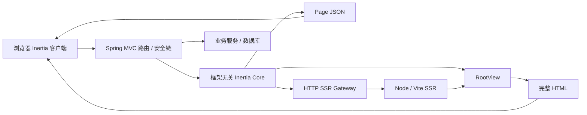

# Java 架构规划

## 1. 用户路径与所有权

浏览器直接打开 `/users` 时得到完整 HTML；开启 SSR 时可在 JavaScript 加载前看到列表。点击 Inertia Link 后仍访问 Java 路由，但响应为 Page JSON。提交表单失败通过 redirect + session errors 回到表单，成功通过 flash 显示通知。部署新版本后旧客户端的下一次 GET 被引导刷新资源。SSR 不可用仍能进入页面并由客户端挂载。

Java 业务拥有鉴权、验证、数据库和事务；适配库拥有协议与渲染编排；前端拥有组件和 hydration；Node SSR 拥有 JavaScript 组件执行。禁止 SSR 服务再次访问数据库以重建 props。



## 2. 拟定工程结构

```text
inertia-java/
  pom.xml
  inertia-core/                   # 协议、props、Page、会话 SPI、RootView SPI
  inertia-ssr-http/               # JDK HttpClient 网关
  inertia-vite/                   # hot/manifest、asset tags 与版本
  inertia-spring-webmvc/          # Servlet/Spring 扩展点
  inertia-spring-boot-autoconfigure/
  inertia-spring-boot-starter/    # 常规引入入口，不包含示例业务
  inertia-testing/               # Page 断言、HTTP/HTML 提取
  examples/spring-react/          # Java 应用、独立 frontend/、SSR entry
  compatibility/fixtures/        # 请求、Page、响应合同及来源说明
  docs/
```

core 仅依赖 JDK 与 Jackson JSON 树/编解码能力，不依赖 Spring、Servlet、JPA 或 Node。Spring 模块单向依赖 core，SSR/Vite 为可选能力。Boot BOM 统一其生态版本；Jackson 主版本在首个 Boot 基线确定时锁定，不在一个模块中混用不同主版本 API。使用成熟 HTTP、JSON、Session、模板和前端库，不自建 JS 执行器或会话服务器。

## 3. 核心模型与拟定 API

| 模型 | 生命周期和约束 |
|---|---|
| InertiaConfig | 应用级不可变；配置只在启动阶段构建 |
| InertiaRequest | 每请求不可变协议快照，含原始外部 path/query |
| InertiaContext | 每请求，持有 pending；不可放入单例控制器字段 |
| InertiaResponse | 一次解析，组件、props、状态、头、view data、SSR 开关 |
| Prop / PropOptions | 不可变定义，supplier 只在请求内被命中时调用一次 |
| Page / PageMetadata | 已解析数据快照，codec 负责 camelCase/省略规则 |
| HttpOutcome | core 的状态/多值头/body，不含 Servlet 类型 |
| RootView | 输入 RenderView，输出最终 HTML；业务 view data 不进入 props |
| SessionStore | get、put、pull 及快照完成策略；实现定义并发保证 |
| SsrGateway | 返回 Rendered 或明确 Fallback 原因 |

拟定用法（设计示例，当前不可编译）：

```java
@Controller
class UsersController {
    @GetMapping("/users")
    InertiaResponse index(InertiaContext inertia) {
        return inertia.render("Users/Index", Props.builder()
            .put("users", users.findPage())
            .put("stats", Prop.defer(() -> stats.load()).group("dashboard"))
            .put("auth.user", Prop.always(currentUser.publicDto()))
            .build());
    }
}
```

首版控制器使用 `@Controller` 和专用返回值处理器；不支持把此对象直接交给 `@ResponseBody`/默认 Jackson converter。启动检查或清晰异常提示错误用法，防止将待渲染对象作为普通 JSON 发出。`ResponseEntity<InertiaResponse>` 留待专门扩展，不在首版宣称支持。

Prop 来源拟采用 sealed interface：Literal、Nested、SyncComputed、AsyncComputed；行为由 Loading(EAGER/OPTIONAL/DEFERRED)、always、MergeOptions、OnceOptions、ScrollOptions、rescue 组合表达。避免为每种组合生成继承类。

## 4. 执行模型

core 返回 CompletionStage；同步 supplier 经注入 Executor 执行，异步 supplier 直接组合。Spring MVC 首版在返回值处理器中有界等待整个结果，部署可以使用虚拟线程；虚拟线程不能取消 JDBC 或赋予事务跨线程能力。

数据库事务在业务服务边界内打开和关闭；并发 props 各自调用自己的事务服务。禁止共享 EntityManager、延迟加载实体或依赖父控制器事务在 worker 中继续存在。以 DTO 输入 Page。Security/locale/MDC 使用显式不可变 RequestSnapshot 或受控 context 装饰器传递，禁止裸用全局 ThreadLocal。

WebFlux 后续把 CompletionStage 转为 reactive publisher 并提供独立 session/security 适配；不在 event loop 上等待 Future 或运行阻塞 supplier。

## 5. 配置与运维

建议配置域 `inertia.*`：version/root-id/SSR 开关、endpoint、connect-timeout、render-timeout、fallback-policy、except、vite hot-file/manifest、props deadline/max-concurrency、session failure-policy。所有时间和大小限制均可配置。

首个性能起点：SSR connect 200ms、render 1s、props 总预算 3s、单请求并发 8、SSR 响应上限 2MiB。它们是待压测调整的设计值；页面整体预算需覆盖业务、props、SSR、模板与写出，不能简单相加后无上限等待。

生产提供 Java app、Node SSR 两个进程/容器，使用同一 build id；静态资源可由反向代理/CDN 提供。SSR 仅内部网络开放。Java 不在 HTTP 请求中执行 npm build 或临时启动 Node。客户端、SSR bundle、manifest、Java 配置的版本一致后切换流量，保留旧带 hash 资源支持滚动升级。

指标：props 时延/失败、SSR 时延/成功/降级原因、version conflict、session 失败、响应类型。日志带 request id、组件和 endpoint 标识，不记录完整 props、Cookie 或 SSR 错误正文。SSR 健康不应直接导致 Java liveness 失败；readiness 根据业务是否强制 SSR 决定。
