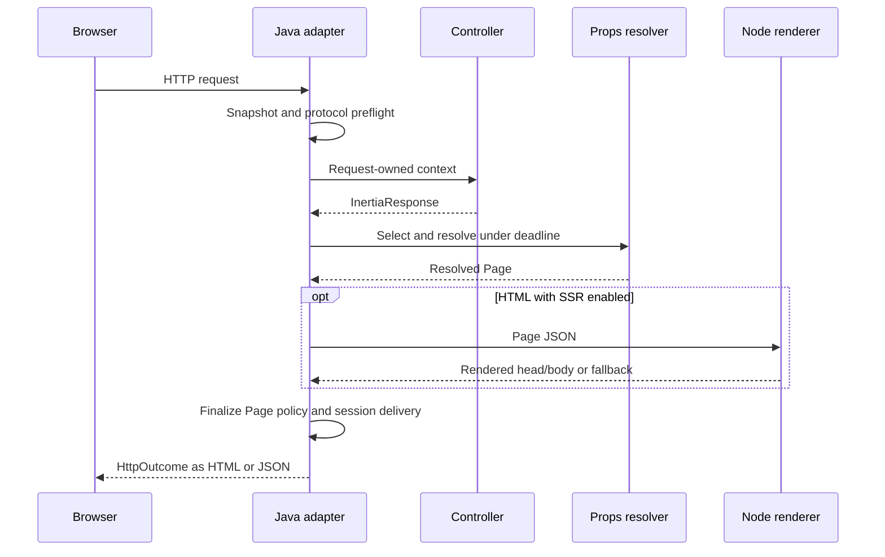

# Request and response lifecycle

A response crosses several ownership boundaries: HTTP snapshot, protocol preflight, request context, prop resolution, optional SSR, session delivery and response writing. Keep that order when building an adapter or replacing Spring defaults.

## Page flow

A stale-version preflight can finish the request before the controller and business queries. It should not begin a session delivery reservation. For a normal Page, rendering composes shared/request/page definitions, resolves only selected sources, then creates the final outcome. The MVC adapter writes that outcome.

## Redirect flow

A controller can queue flash/errors/history instructions on its context and return `HttpOutcome`. Before writing it, the adapter calls `context.commitRedirect()` and applies `ProtocolPolicy.after`. PUT/PATCH/DELETE redirects can become 303 according to policy.

Page rendering already finalizes its delivery and Page policy. Calling `commitRedirect()` after rendering a Page would reuse a single-use context and is incorrect. The [core API example](../examples/CoreApiExample.java) demonstrates the explicit host-adapter sequence; the Spring adapter performs it for typed handlers.

## Failure and cancellation

One total props deadline and a per-request concurrency cap bound sibling resolution. Fatal unrescued failures cancel owned siblings. Successful result/metadata order follows declaration order; the first observed parallel failure is not guaranteed to follow that order.

If rendering fails before session delivery commits, abort restores the reserved stored delivery and discards that failed request's queued effects. A transport timeout must cancel owned work and abort an uncommitted context. Underlying database/HTTP operations still need provider-level timeouts and cancellation support.

Application exception handlers retain precedence. Typed error Pages use a fresh sessionless context; typed outcome advice uses a fresh context with the original session store/namespace for its own redirect effects. A safe library error page is a final bounded fallback, not an infinite recursive render.

## Producing an outcome is not browser delivery

Session completion precedes writing the HTTP body. A later network write failure cannot roll back a completed session transaction or prove that the browser saw the flash. Observation events distinguish rendering from response-write attempts; neither is a distributed exactly-once delivery guarantee.

Read [ownership](ownership.md) before sharing objects or moving callbacks onto an executor, and [the protocol](protocol.md) before writing an independent HTTP adapter.
