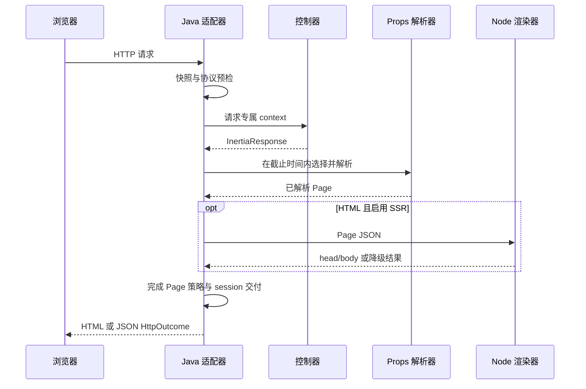

# 请求与响应生命周期

响应跨越 HTTP 快照、协议预检、请求 context、props 解析、可选 SSR、会话交付和响应写出等边界。实现适配器或替换 Spring 默认组件时，保持这些操作的顺序。

## Page 流程

过期版本预检可以在 controller 和业务查询之前结束请求，不应开始 session 交付预留。正常 Page 先组合 shared/request/page 定义，只执行被选中的来源，再生成最终 outcome，由 MVC 写出。

## 重定向流程

controller 可以在 context 排队 flash/errors/history 指令，然后返回 `HttpOutcome`。写出前，适配器调用 `context.commitRedirect()` 并应用 `ProtocolPolicy.after`。PUT/PATCH/DELETE 重定向可能按策略转换为 303。

Page 渲染已经完成交付和页面策略；此后再调用 `commitRedirect()` 会复用只能使用一次的 context，属于错误用法。[CoreApiExample.java](../../examples/CoreApiExample.java)展示显式适配顺序，Spring 为类型化 handler 完成对应步骤。

## 失败与取消

所有 props 共用总截止时间，并受每请求并发上限约束。未被 rescue 的致命失败会取消本请求拥有的兄弟任务。成功结果和元数据按声明顺序输出，但并行任务中最先观察到的失败不保证符合声明顺序。

渲染在 session 交付提交前失败时，abort 恢复预留的已有交付并丢弃失败请求新排队的效果。传输层超时应取消本请求任务并 abort 尚未提交的 context。底层数据库/HTTP 操作仍需要 provider 自己支持超时和取消。

应用异常处理器优先。类型化错误 Page 使用新的无会话 context；类型化 outcome advice 使用新 context，并保留原 store/namespace，只提交自己的重定向效果。库的安全错误页是有界最终回退，不是无限递归渲染。

## 生成 outcome 不等于浏览器收到

session completion 发生在 HTTP body 写出之前。后续网络写出失败不能回滚已经完成的会话事务，也无法证明浏览器看到了 flash。观测事件分别记录 render 和 response-write 尝试，都不构成分布式“恰好交付一次”保证。

共享对象或把 callback 移到 executor 前，阅读[所有权](ownership.md)；实现其他 HTTP 适配器前，阅读[协议](protocol.md)。
